# Megnézendő filmek és sorozatok – felhasználói leírás

Ez az app kézikönyve: minden, amit tud, témák szerint, képekkel. Nem kell az elejétől a végéig
elolvasni – ugorj oda, ami épp érdekel. Ahol egy képen sok minden van, kis borostyánszínű számok
(①②③) jelölik a részeit, és a szöveg ugyanezekkel a számokkal mesél róluk.

Időről időre frissül, nem minden apró változás után – így előfordulhat, hogy a felület már egy
kicsit előrébb jár. Hogy legutóbb mi került bele, azt a végén, a **Változásnaplóban** találod.

Utolsó frissítés: 2026. 10. 08. · Élő oldal: https://filmlista-six.vercel.app/

> Tipp: VS Code-ban a **Ctrl+Shift+V** formázott előnézetben nyitja meg ezt a leírást – így a képek
> is látszanak.

## Tartalom

1. [Belépés és telepítés](#1-belépés-és-telepítés)
2. [A lista: nézetek és lapozás](#2-a-lista-nézetek-és-lapozás)
3. [Szűrés, keresés, rendezés](#3-szűrés-keresés-rendezés)
4. [Címek felvétele](#4-címek-felvétele)
5. [Egy cím adatlapja és szerkesztése](#5-egy-cím-adatlapja-és-szerkesztése)
6. [Állapotok, letöltve, értékelések](#6-állapotok-letöltve-értékelések)
7. [Sorozatok és évadok](#7-sorozatok-és-évadok)
8. [Még meg nem jelent filmek](#8-még-meg-nem-jelent-filmek)
9. [Franchise-ok és gyűjtemények](#9-franchise-ok-és-gyűjtemények)
10. [Mama-jelölések](#10-mama-jelölések)
11. [Értesítések](#11-értesítések)
12. [IMDb](#12-imdb)
13. [Statisztika](#13-statisztika)
14. [Mentések és adatbiztonság](#14-mentések-és-adatbiztonság)
15. [Telefonon](#15-telefonon)
16. [Billentyűzet, kényelmi apróságok](#16-billentyűzet-kényelmi-apróságok)
17. [Honnan jönnek az adatok?](#17-honnan-jönnek-az-adatok)
18. [Változásnapló](#18-változásnapló)

---

## 1. Belépés és telepítés

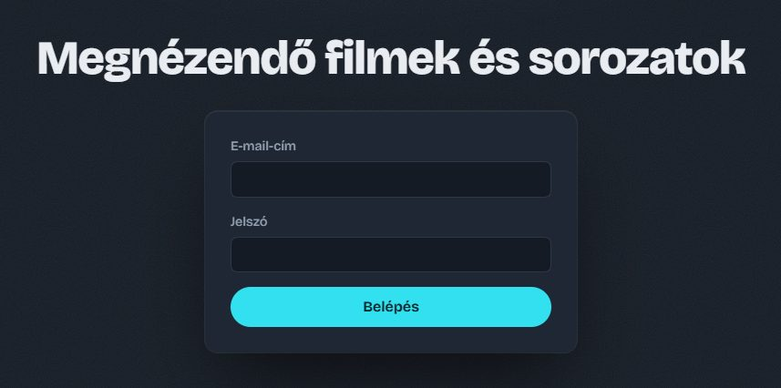

**Belépés:** e-mail-cím, jelszó, **Belépés** – és már bent is vagy. A böngésző megjegyzi, így nem
kell minden alkalommal újra begépelned. Regisztrálni nem lehet; új fiókot csak a Supabase
felületén lehet létrehozni. Ha végeztél, a **Kilépés** gombot a fejlécben, az e-mail-címed mellett
találod. (Mama a saját fiókjával lép be, és nem a listádat, hanem a saját, egyszerű oldalát látja –
lásd [10.](#10-mama-jelölések).)

**Legyen saját ablaka!** Az app telepíthető, mintha rendes program lenne:
- *Számítógépen (Chrome / Edge):* a címsor jobb szélén a „Telepítés” ikon. Utána a Start menüből és
  a tálcáról indul, saját ikonnal (türkiz filmcsapó sötét alapon), böngészősáv nélkül.
- *Telefonon:* a böngésző menüjében „Hozzáadás a kezdőképernyőhöz”.
- Bónusz: a telepített app ikonján egy kis szám jelzi, ha olvasatlan értesítésed van (ahol a
  rendszer tudja ezt).
- **Gyorsindítók:** jobb klikk a telepített app ikonjára (a tálcán vagy a Start menüben; telefonon
  hosszan nyomva), és rögtön oda ugorhatsz, ahová épp mennél: **Cím hozzáadása**, **Franchise-ok**
  vagy **Statisztika**. Az app elindul, és a lista betöltése után magától megnyitja. (Ha az app már
  korábban telepítve volt, a Chrome néha csak az app újraindítása után mutatja ezeket.)

**Net nélkül is elindul:** az app megjegyzi a legutóbb látott listádat, így indításkor **azonnal**
ott van – nem kell a betöltésre várnod. A friss lista a háttérben érkezik (addig a darabszám mellett
„· frissítés…” áll), és magától a helyére lép.

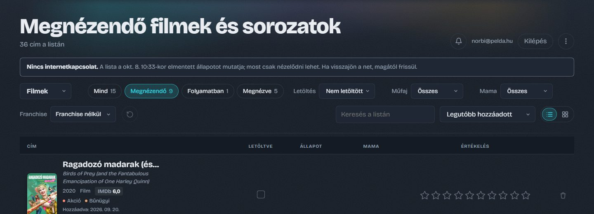

Ha épp nincs internet (vonaton, rossz wifin), az app akkor is elindul, és a legutóbb elmentett
listát mutatja. Fölötte sáv jelzi: „**Nincs internetkapcsolat.** A lista a … -kor elmentett állapotot
mutatja; most csak nézelődni lehet. Ha visszajön a net, magától frissül.” Ilyenkor böngészni,
szűrni, keresni és az adatlapokat nézegetni lehet, módosítani viszont nem: nincs **Cím hozzáadása**,
a lista vezérlői és az adatlap mezői tiltva vannak, a ⋮ menüből pedig kimarad az IMDb import, a
Tömeges import és a Mentések. Amint visszajön a net, a sáv eltűnik, és minden újra a régi. (Ez a
borítókra is igaz, amiket már láttál; a még sosem látott borítók helyén net nélkül üres hely lesz.)

## 2. A lista: nézetek és lapozás

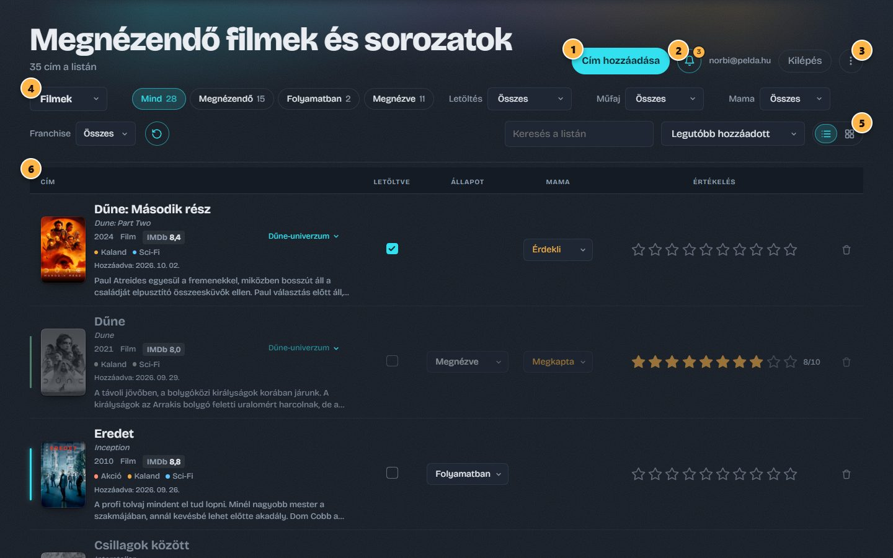

Ez a főoldal, itt él a listád. A fejlécben:
- ① **Cím hozzáadása** – új film vagy sorozat felvétele (lásd [4.](#4-címek-felvétele));
- ② a **harang** – értesítések új évadokról, megjelenésekről (lásd [11.](#11-értesítések));
- mellette az e-mail-címed és a **Kilépés**;
- ③ a **⋮ További műveletek** menü – a ritkábban kellő dolgok gyűjtőhelye.

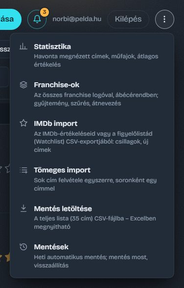

A ⋮ menüben minden pont mellett rövid leírás is áll, hogy ne kelljen találgatnod: **Statisztika**,
**Franchise-ok**, **IMDb import**, **Tömeges import**, **Mentés letöltése**, **Mentések**.

④ A fejléc alatt a **szűrősor** (részletek a [3.](#3-szűrés-keresés-rendezés) pontban), ⑤ a jobb
szélén pedig a **nézetváltó**: két kis ikon, lista vagy rács.

**Két nézet, ahogy kedved tartja:**
- **Lista (táblázat)** – csak széles képernyőn (legalább 1400 px). ⑥ Soronként: borító, cím (eredeti
  címmel, évvel, IMDb-értékkel, műfajokkal), franchise, a TMDB leírása, Letöltve, Állapot, Mama,
  Saját értékelés és a kuka. Szinte mindent helyben, a sorban át tudsz állítani (lásd
  [5.](#5-egy-cím-adatlapja-és-szerkesztése)).
- **Rács (borítófal)** – nagy borítók kártyákon. 1400 px alatt mindig ez látszik.
- A választásodat a böngésző megjegyzi.

**Egy kártyán** ott van minden fontos: borító (ha rámutatsz, a borító színében felfénylik), cím
(rákattintva az IMDb-adatlap nyílik, ha nincs IMDb-azonosító, a TMDB-é), eredeti cím, év, típus,
IMDb-érték, műfajok színes pöttyel, a saját értékelésed kis csillagokkal, „Hozzáadva: <dátum>”, és
a borító jobb felső sarkában a jelvények: „Letöltve”, ha le van töltve, és egy borostyánszínű **„M”**,
ha Mamát érdekli (lásd [10.](#10-mama-jelölések)). A **borítóra** kattintva az adatlap nyílik.

**Lapozás:** lista nézetben és telefonon oldalanként 25 cím, asztali rácsban 22 (1440p-n ez soronként
11 kártya, vagyis két szép, teli sor). Asztali rácsban a lapozó és alatta a lábléc **mindig az ablak
alján** ül, áttetsző sávban – így minden oldalon pontosan ugyanott találod, és görgetni csak akkor
kell, ha a kártyák nem férnek ki. Lista és rács között váltva az az oldal jön, amelyiken az addig
látott első cím van, szóval nem veszted el a fonalat. Ha szűrsz, rendezel vagy keresel, az 1. oldalra
ugrik; lapozáskor a lista tetejére görget.

**Betöltés közben** a lista helyén halványan csillogó „csontváz” jelzi, hogy mindjárt jön minden –
de csak a legelső alkalommal: utána az app azonnal a legutóbb látott listát mutatja, és a háttérben
frissíti (lásd [1.](#1-belépés-és-telepítés)).

## 3. Szűrés, keresés, rendezés

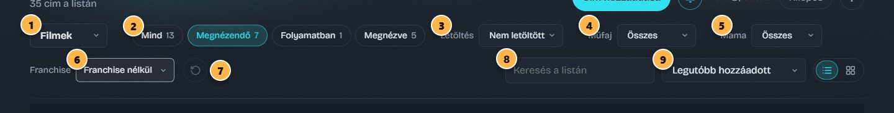

A szűrősorral pillanatok alatt arra szűkítheted a listát, ami épp érdekel. Balról jobbra:

| | Szűrő | Lehetőségek |
|---|---|---|
| ① | Típus | Filmek / Sorozatok (franchise-ra szűrve vagy keresés közben: Filmek és sorozatok is) |
| ② | Állapot | Mind · Megnézendő · Folyamatban · Megnézve · Abbahagyva (csak sorozatoknál) – mindegyik mellett a darabszám, ami a többi szűrőt is figyelembe veszi |
| ③ | Letöltés | Összes / Letöltött / Nem letöltött |
| ④ | Műfaj | az adott típus műfajai |
| ⑤ | Mama | Összes / Érdekli / Nem érdekli / Megkapta (csak ha van Mama-jelölés) |
| ⑥ | Franchise | Összes / Franchise nélkül / a franchise-aid logóval – egy franchise kiválasztásakor az Állapot magától „Mind” lesz (lásd [9.](#9-franchise-ok-és-gyűjtemények)) |

⑦ **Vissza alapállapotba (↺):** egy kattintás, és minden szűrő visszaáll erre: Filmek – Megnézendő
– Nem letöltött – Összes műfaj – Franchise nélkül. Betöltéskor is így indul. Ha valamit
átállítottál, a ↺ élénk, alapállapotban halvány – így első ránézésre látod, szűrsz-e épp valamire.

⑧ **Keresés a listán:** a címben és az eredeti címben keres, és nem zavarja a kis- és nagybetű vagy
az ékezet („dune” is megtalálja a „Dűne”-t). Több szónál mindegyiknek szerepelnie kell. Gépelés
közben az **egész listádon** keres – a szűrők félreállnak, de közben szűkítheted őket –, a keresés
törlésekor pedig visszakapod a korábbi szűrőidet.

⑨ **Rendezés:** Legutóbb hozzáadott · Legkorábban hozzáadott · Legjobb saját értékelés · Legjobb
IMDb-értékelés · Legújabb megjelenés · Legrégebbi megjelenés. Ami nem kapott értéket, a végére
kerül. Ha egy franchise-ra szűrsz, és annak van **saját nézési sorrendje**, a lista elején **Nézési
sorrend** is megjelenik, és a rendezés magától erre áll; ha nincs, magától **Legrégebbi megjelenés**
lesz – így a részek sorban jönnek (részletek: [9.](#9-franchise-ok-és-gyűjtemények)).

**A szűrősor veled tart:** lefelé görgetve a képernyő tetején marad, áttetsző üvegként. Asztalon
ilyenkor két gyorsgomb is felbukkan mellette: **+** (Cím hozzáadása) és **↑** (vissza a lap
tetejére).

**Nem tűnik el a kezed alól:** ha egy címet úgy módosítasz, hogy már nem illik a szűrőbe (mondjuk
„Nem letöltött” nézetben letöltöttnek jelölöd), nem ugrik el rögtön – a helyén marad, így ha
mellékattintottál, vissza tudod venni. A szűrés következő változásakor kerül le.

**Ha nincs találat**, az üres oldal sem hagy magadra: „Szűrők törlése”, „Felfedezés”; keresésnél
„Keresés a TMDB-n: „…”” (a Cím hozzáadása panel a beírt szöveggel nyílik) és „Keresés törlése”.

## 4. Címek felvétele

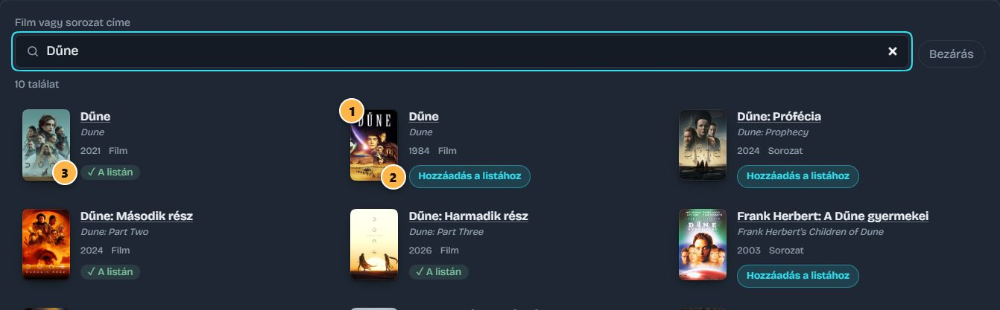

**Cím hozzáadása panel** (a fejléc gombja; telefonon a jobb alsó sarokban lévő kerek **+**):
- Kezdd el gépelni a címet (pl. „Dűne”) – egy pillanat, és ott vannak a TMDB találatai borítóval,
  évvel, típussal. ② **Hozzáadás a listához**, és kész. ③ Ami már a listádon van, azt a „✓ A
  listán” jelzi.
- ① **Előbb megnéznéd?** Kattints a találat **borítójára vagy címére**: megnyílik a cím
  **adatlapja**, pont olyan, mint a listán lévőké – háttérkép, nagy borító, év, IMDb-érték, „Hol
  nézhető?”, előzetes, leírás, Hasonló címek –, csak éppen **listára vétel nélkül**. Az állapot, a
  franchise és a csillagok helyén egyetlen gomb vár: **Hozzáadás a listához**. Ha rákattintasz, a
  cím felkerül, az ablak pedig nyitva marad, és helyben rendes adatlappá válik („✓ Felkerült a
  listádra”) – rögtön beállíthatod az állapotát, az értékelését. Ha mégsem kell: **Bezárás** / Esc /
  kikattintás. A már listán lévő találat borítója a saját, szerkeszthető adatlapját nyitja.
- Felvételkor a cím mindent megkap, amire szükség van: magyar címet és leírást (ha nincs magyar,
  angolt), műfajokat, borítót, háttérképet, IMDb-értékelést, sorozatnál az évadokat, filmnél a
  megjelenési dátumokat. Neked semmit nem kell kitöltened.

**Felfedezés – ha nem tudod, mit keress:** amíg a keresőmező üres, a panel ajánl.

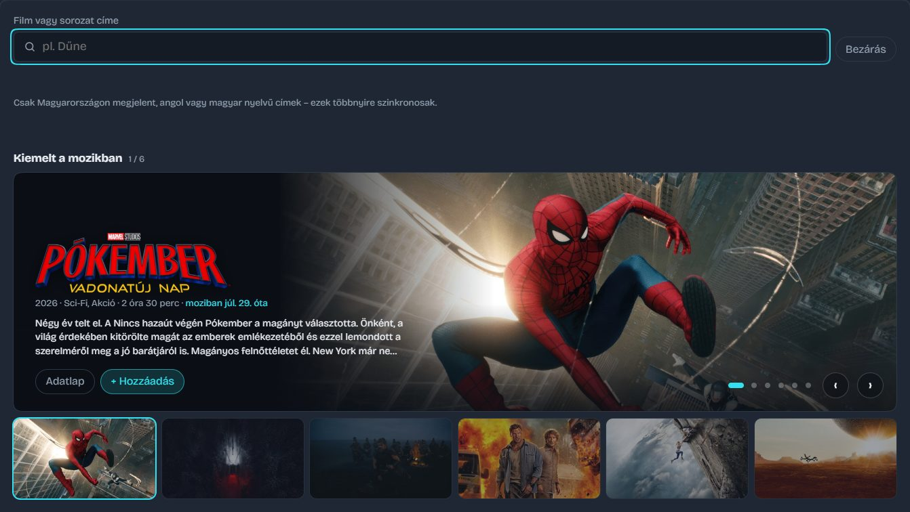

**Kiemelt a mozikban** – legfelül egy nagy sáv a mozikban épp futó filmek közül hat címmel, egyenként:
széles jelenetkép, a film logója (ha nincs, a címe), év · műfajok · játékidő · „moziban júl. 29. óta”,
a leírás eleje, és két gomb: **Adatlap** (megnézed, mielőtt felveszed) és **+ Hozzáadás** (ami már a
listádon van, annál „✓ A listán”). Lapozni a **‹ / ›** nyíllal, a pöttyökkel vagy az alattuk lévő kis
képekkel lehet – telefonon ujjal húzva. Magától nem lapoz, nyugodtan elolvashatod. Ha egy kiemelt film
nem érdekel, a **×**-szel elrejtheted (lásd lent), és a helyére a következő lép.

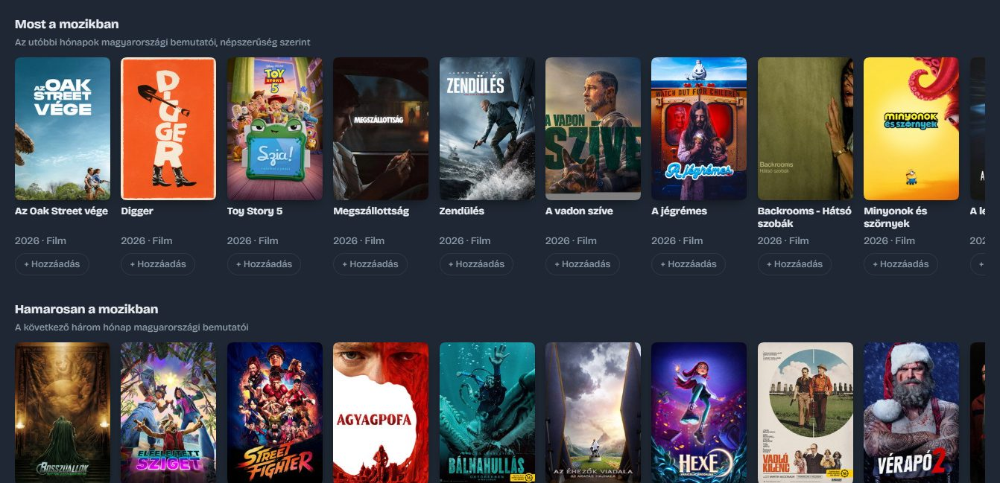

Alatta vízszintes borítósorok: *Most a mozikban* (a fent kiemeltek nélkül, hogy ne lásd kétszer),
*Hamarosan a mozikban* (dátummal), *Új digitálisan*, *Népszerű sorozatok*. Egy kattintás („+
Hozzáadás”), és a listádon van; a **borítóra** kattintva előbb az adatlapját is megnézheted (mint a
találatoknál). Csak olyan címeket mutat, amelyek valószínűleg **magyar szinkronnal** is elérhetők:
Magyarországon megjelent (sorozatnál magyar streamingen fut), angol vagy magyar nyelvű, van magyar
leírása, és nem dokumentum-, valóság- vagy talkshow.

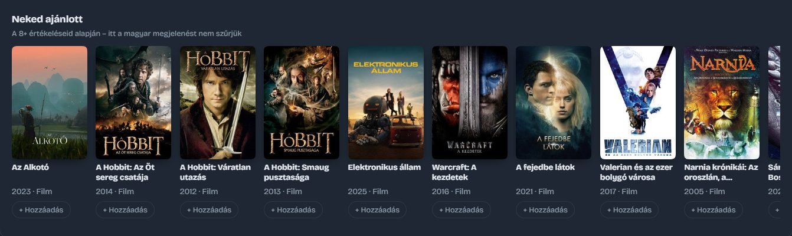

**Neked ajánlott** – az utolsó sor csak rólad szól: azokhoz a címekhez keres hasonlókat, amelyeket
legalább **8 csillagra** értékeltél (a legjobbakhoz, azon belül a legutóbb látottakhoz). Elöl az áll,
amit több kedvencedhez is ajánl a TMDB – az nagy eséllyel betalál. Ami már a listádon van, kimarad. Itt
a magyar megjelenést nem szűri (az alcím is jelzi). Ha még nincs 8+ értékelésed, ez a sor nem látszik.

**Nem érdekel:** ha egy ajánlott cím hidegen hagy, mutass a borítójára – a jobb felső sarkában
megjelenik egy **×** (telefonon mindig látszik). Rákattintva eltűnik, és többé sem a Felfedezés, sem a
Hasonló címek nem ajánlja (a keresésben azért továbbra is megtalálod). Fölötte 10 másodpercig ott a
„„…” elrejtve – többé nem ajánljuk. **Visszavonás**”, ha csak elkattintottad. Később meggondoltad
magad? A Felfedezés alján az **Elrejtett ajánlások (N)** alatt minden rejtett cím mellett ott a
**Mégis érdekel**.

**Hasonló címek** – minden adatlap alján (lásd [5.](#5-egy-cím-adatlapja-és-szerkesztése)),
„+ Hozzáadás” gombbal; a borítójukra kattintva az adatlapjuk ugyanabban az ablakban nyílik. A **×**
itt is működik (a „Visszavonás” a Hasonló címek tetején jelenik meg).

**Franchise-javaslat felvételkor:** ha olyan filmet veszel fel, ami egy franchise-od TMDB-gyűjteményébe
tartozik (mondjuk a Mátrix második részét, és van „Mátrix” franchise-od), pár másodperc múlva alul
megkérdezi: „„…” – a Mátrix franchise-ba tartozik?” → **Hozzárendelés**. Magától soha nem rendeli
hozzá, csak felajánlja. Ha egyszerre több ilyen film kerül fel (pl. tömeges importtal), egy sávban
szól („N új film egy franchise-odba tartozik” → **Megnézés**), és a Franchise-ok ablakban egyben
elintézheted őket (lásd [9.](#9-franchise-ok-és-gyűjtemények)).

**Tömeges import – ha sok címed van egyszerre** (⋮ menü, csak széles képernyőn):
1. Írd be soronként egy címet, legfeljebb 150-et. Ha a sor végére évszámot írsz, pontosabb lesz a
   találat (pl. „Dűne 2021” vagy „A sötét lovag (2008)”); az ismétlődő sorok csak egyszer
   számítanak.
2. **Keresés** – a biztos (pontosan egyező) találatok előre ki vannak jelölve. Ahol az app nem biztos
   a dolgában, borítós választót kapsz („Másik találat”), alapból „Kihagyás”. Ami már a listádon van,
   az kimarad.
3. **„N cím felvétele”** – ha valamelyik nem sikerült, a sora a szövegmezőben marad, újrapróbálhatod.

**Egy franchise hiányzó részei** – a gyűjtemény ablakából egy kattintással (lásd
[9.](#9-franchise-ok-és-gyűjtemények)).

## 5. Egy cím adatlapja és szerkesztése

**Megnyitás:** kattints a borítóra (kártyán és listasorban is), vagy a kártya bal felső sarkában a
ceruzára. Asztalon a borító szépen „átsiklik” az ablak nagy borítójának helyére. A még nem listán
lévő címek adatlapja a Cím hozzáadása találataiból és a Felfedezésből nyílik (lásd
[4.](#4-címek-felvétele)).

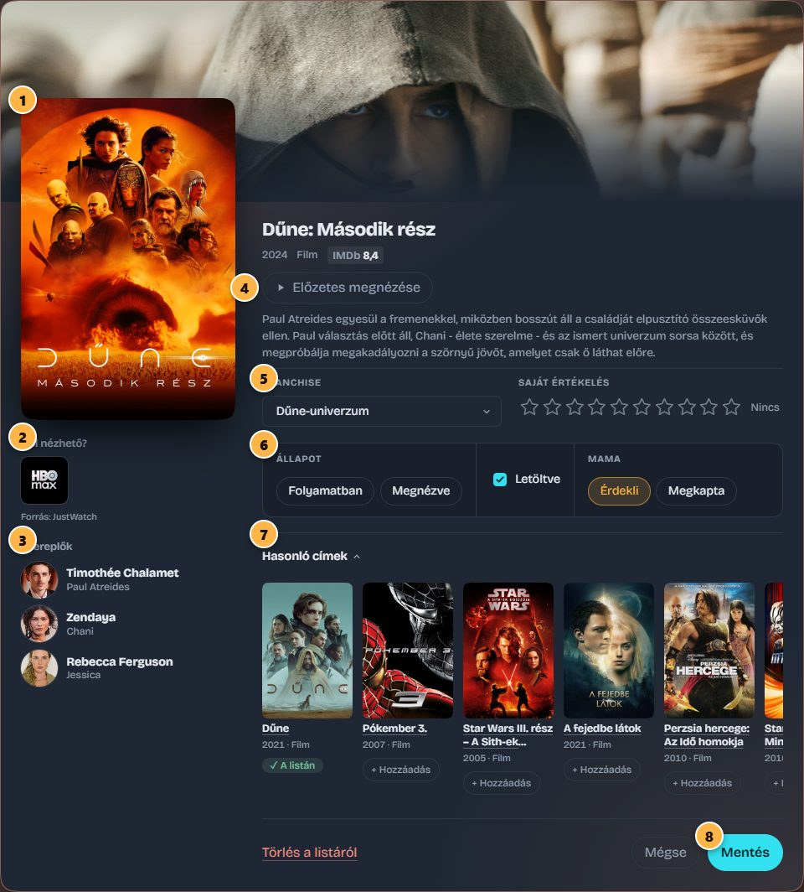

**Mit találsz az adatlapon:**
- felül a film széles jelenetképe (ha van), ① asztalon (900 px fölött) balra a nagy borító; az egész
  ablak halványan a borító színében dereng;
- cím, év, típus, IMDb-érték, a még meg nem jelent filmeknél dátumos jelvény;
- ② **Hol nézhető?** – a magyarországi streamingszolgáltatók logói, ahol a cím előfizetéssel
  (Netflix, HBO Max, Disney Plus, SkyShowtime…) vagy ingyen nézhető; asztalon a nagy borító alatt,
  keskenyebben az „Előzetes megnézése” fölött. A logóra mutatva kiírja a szolgáltató nevét.
  Kölcsönzés és vásárlás nem szerepel, és ha sehol nem nézhető, a blokk meg sem jelenik. Az adatok a
  JustWatch-tól jönnek (a TMDB-n keresztül, naponta frissülnek);
- ③ **Szereplők:** az első három szereplő. Széles képernyőn a bal oszlopban, kerek fotóval és a
  szerep nevével; keskenyebben (telefonon) a leírás alatt egy sorban. A **névre** kattintva a színész
  TMDB-oldala nyílik új lapon. (A szerepnevek a TMDB-ről jönnek, gyakran angolul.)
- ④ **Előzetes megnézése** (ha van; angol előzetesnél ott a jelzés: „angolul”) – az ablakon belül
  játssza le, az **Előzetes bezárása** gombbal pedig eltünteted;
- a TMDB leírása;
- ⑤ egymás mellett a **Franchise** és a **Saját értékelés** (10 csillag), ⑥ alattuk egy keretes
  sávban, asztalon egy sorban az **Állapot** (Folyamatban / Megnézve), a **Letöltés** (egyetlen
  **Letöltve** gomb – újra kattintva kikapcsol) és a **Mama** (Érdekli / Nem érdekli / Megkapta).
  Mindhárom gombsor ugyanúgy működik: a kiválasztottra újra kattintva üres lesz. Telefonon a sávban
  fent az Állapot, alatta a Letöltés és a Mama; a Franchise és a csillagok egymás alatt;
- sorozatnál az állapot helyett az **évadok** (lásd [7.](#7-sorozatok-és-évadok));
- ⑦ alul **Hasonló címek**: a TMDB ajánlásai egy vízszintes sorban, „+ Hozzáadás” / „✓ A listán”. A
  **borítóra** kattintva a hasonló cím adatlapja nyílik **ugyanebben az ablakban** (ha még nincs a
  listádon, előnézetként, „Hozzáadás a listához” gombbal); a cím fölötti **„‹ Vissza: …”** visz
  vissza az előzőre – akár több lépésen át is, mint egy kis böngészőben. A hasonló cím **nevére**
  kattintva a TMDB-oldala nyílik új lapon. Ha mentetlen módosításod van, a hasonló címre kattintva
  nem lép tovább, hanem szól („Mentetlen módosítás – Mentés vagy Mégse”). A sor becsukható, és a
  böngésző megjegyzi (telefonon mindig csukva indul). Csak a 2000-es vagy újabb, a TMDB-n legalább
  6,0-ra értékelt (és legalább 50 szavazatot kapott) címeket ajánlja – a régi vagy gyenge filmek
  kimaradnak.

**Mentés és bezárás:** ⑧ **Mentés** – a módosítások mentése; **Mégse** vagy **Esc** – bezárás
mentés nélkül (az Esc akkor is bezárja, ha módosítottál valamit).
- **Asztalon elég az ablak mellé kattintani**, és bezárul. Ha viszont **mentetlen módosításod** van
  (mondjuk átállítottad a csillagokat), nyitva marad, nehogy elvesszen: a gombok előtt megjelenik a
  „Mentetlen módosítás – Mentés vagy Mégse” felirat, és a Mentés gomb felvillan. Ha a módosítást
  visszacsinálod, a kikattintás újra bezárja.
- Akkor sem zárul be, ha épp a törlést erősítenéd meg, vagy a Franchise mezőben új nevet gépelsz; és
  akkor sem, ha szöveget jelölsz ki, és az egér az ablakon kívül áll meg.
- Az évadok változása azonnal mentődik, az nem számít mentetlen módosításnak.
- Telefonon az ablak alulról felcsúszó lap: a tetején lévő fogantyút lefelé húzva bezárul (a
  háttérre koppintás ott nem zár).

**Törlés az adatlapról:** **Törlés a listáról** → megerősítés → a cím lekerül, és alul 8
másodpercig ott a **Visszavonás**, ha mégis meggondolnád magad.

**Szerkesztés közvetlenül a listasorban** (lista nézet): Letöltve pipa, Állapot és Mama lenyíló,
csillagok, franchise lenyíló (üresen csak akkor látszik, ha a sorra mutatsz), a sor végén kuka.
Minden **azonnal mentődik**; ha valami hiba van, visszaáll az előző érték. A **kukával** megerősítés
nélkül lekerül a cím – 8 másodpercig **Visszavonás**. Véglegesen csak ezután törlődik (ha közben
bezárod az oldalt, a cím megmarad).

## 6. Állapotok, letöltve, értékelések

**Állapotok – hol tartasz egy címmel:**
- **Megnézendő** – az alapállapot. Ezért szándékosan **nem jelenik meg** felirat vagy szín a soron /
  kártyán (csak a szűrő nevezi meg) – így a lista nincs teleírva ugyanazzal a szóval.
- **Folyamatban** – türkiz.
- **Megnézve** – zöld; a cím **háttérbe húzódik**: fekete-fehér, fakó borító, tompított szöveg
  (rámutatva újra teljes színű). És egy kis jutalom: amikor egy címet (vagy a nézési sorrendben egy
  évadot) Megnézve-re állítasz, egy zöld vonal fut végig a címén – „kihúzod a listádról” –, majd
  elhalványul (a nézési sorrend ablakában a vonal ott marad). Ha a gépen be van kapcsolva a
  „kevesebb mozgás”, nincs animáció.
- **Abbahagyva** – halvány lila, csak sorozatnál (lásd [7.](#7-sorozatok-és-évadok)); ez is háttérbe
  húzódik.
- Az adatlapon a kiválasztott állapotra újra kattintva visszaáll Megnézendőre.
- **A megnézés napja:** amikor egy címet Megnézve-re állítasz, az app a háttérben megjegyzi a napot
  (nem látszik, nem kell beírni). A Statisztika havi kimutatása és a CSV-mentés ebből dolgozik; a
  korábban importált, dátum nélküli megnézett címek ezekben nem szerepelnek.

**Letöltve:** a listasorban egy pipa, az adatlapon egy **Letöltve** gomb (újra kattintva
kikapcsol). Amikor egy cím **Megnézve** lesz, a jelölés magától lekerül – hiszen már nem kell a gépen
tartanod. (Ha utána mégis újra bejelölöd, megmarad.)

**Saját értékelés:** 1–10 csillag, borostyánszínnel. Ugyanarra a csillagra újra kattintva (vagy az
adatlapon a „Törlés” linkkel) törlődik. Nyilakkal is állíthatod.

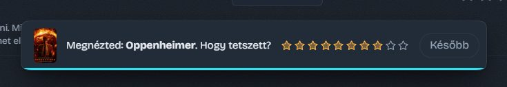

**„Hogy tetszett?”** – ha a listában Megnézve-re állítasz egy még nem értékelt címet, alul felbukkan
egy sáv csillagsorral: egy kattintás, és már értékelted is. Ha most nincs kedved hozzá: **Később**.

**IMDb-értékelés:** „IMDb 8,0” jelvény (rámutatva a szavazatok száma) – lásd [12.](#12-imdb).

## 7. Sorozatok és évadok

Sorozatoknál nem kell egyben gondolkodnod: minden évadot külön követhetsz.

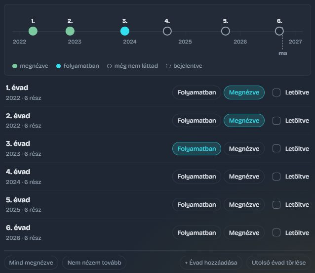

**Évadok az adatlapon:** évadonként saját állapot (Folyamatban / Megnézve) és **Letöltve** pipa.
Alattuk a gombok: **Mind megnézve**, **Nem nézem tovább** / **Mégis folytatom**, **+ Évad
hozzáadása**, **Utolsó évad törlése** (megerősítéssel). Az évadok változása **azonnal mentődik**,
nem kell hozzá a Mentés gomb.

- Ha egy évadot megnézettre állítasz, az előtte lévő üres évadok is megnézettek lesznek (ha a 3.-at
  láttad, az 1–2.-at nyilván már igen) – 10 másodpercig ott a **Visszavonás**, ha mégsem így volt.
- **A sorozat állapota az évadokból számolódik, magától:** minden megjelent évad megnézve →
  Megnézve; van megkezdett vagy megnézett évad → Folyamatban; különben Megnézendő. Letöltve = van
  letöltött évad.
- A **bejelentett** (jövőbeli vagy dátum nélküli) évad szaggatott, nem jelölhető, és nem számít bele
  a „mind megnézve” feltételbe.
- **Abbahagyva** („Nem nézem tovább”): ha egy sorozatot feladtál, a listán marad, de háttérbe
  húzódik; az adatlapon az évadlista tetején lila sáv jelzi. Új évad sem írja felül. A „Mind
  megnézve” feloldja (Megnézve lesz), a „Mégis folytatom” után pedig újra az évadokból számolódik.
- Ha törölsz egy évadot, ami a TMDB-n szerepel, a heti frissítés üresen visszahozza.

**Évadok idővonala** (az adatlapon, legalább 2 évadnál – a fenti kép teteje): évadonként egy pötty a
megjelenés napján, az állapot színével; a bejelentett szaggatott, a „ma” jelölve. Egy pillantás, és
látod, hol tartasz, és mi jön még. A pöttyre kattintva a lista az adott évadhoz görget.

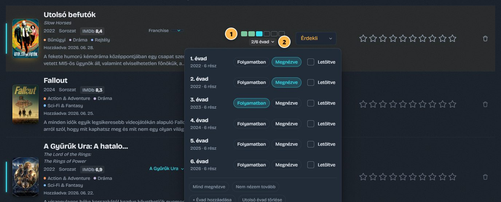

**A listában:** ① az Állapot cellában évadcsík (évadonként egy szakasz); egy szakaszra kattintva
lép: üres → Folyamatban → Megnézve → üres. ② Az „x/y évad” feliratra kattintva lenyíló panel nyílik
az évadokkal – ugyanazok a gombok, mint az adatlapon. A Letöltve cellában a letöltött évadok számai.
**A kártyán:** a borító alján az évadcsík és az „x/y évad”.

**Új évadok maguktól:** az app hetente megnézi a TMDB-n a sorozataidat; az új (megjelent vagy
bejelentett) évad magától felkerül, és a harang szól róla (lásd [11.](#11-értesítések)).
Epizódszintű követés nincs.

## 8. Még meg nem jelent filmek

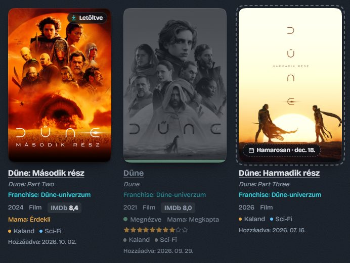

Olyan filmet is felvehetsz, ami még meg sem jelent – az app figyel helyetted. A listán ezek
**szaggatott kerettel** válnak ki, és **dátumos jelvényt** kapnak (kártyán, listasorban, adatlapon):
- **„Hamarosan · dec. 18.”** – még a moziba sem került (vagy csak digitálisan jön); ha csak az éve
  ismert: „Hamarosan · 2027”.
- **„Moziban · digitálisan: okt. 29.”** – moziban fut, letölteni még nem lehet; ha még nincs ismert
  dátum: „digitálisan: még nincs dátum”.
- Telefonon a kártyán csak a dátum („dec. 18.”) vagy a „Moziban” látszik.
- Amint a film digitálisan megjelent, a keret és a jelvény eltűnik, és a **harang szól**:
  „Digitálisan is megjelent – már letölthető”.
- A dátumokat az app a háttérben, 3 naponta frissíti a TMDB-ről (előbb a magyarországi, ha az nincs,
  az amerikai megjelenést nézi). A megnézett filmeknél nincs jelölés.

## 9. Franchise-ok és gyűjtemények

A franchise a saját „dobozod” az összetartozó címeknek – Gyűrűk Ura, Marvel, Mátrix, ami csak
eszedbe jut. Az app ehhez a TMDB gyűjteményeit is segítségül hívja, így azt is látod, mi hiányzik
még.

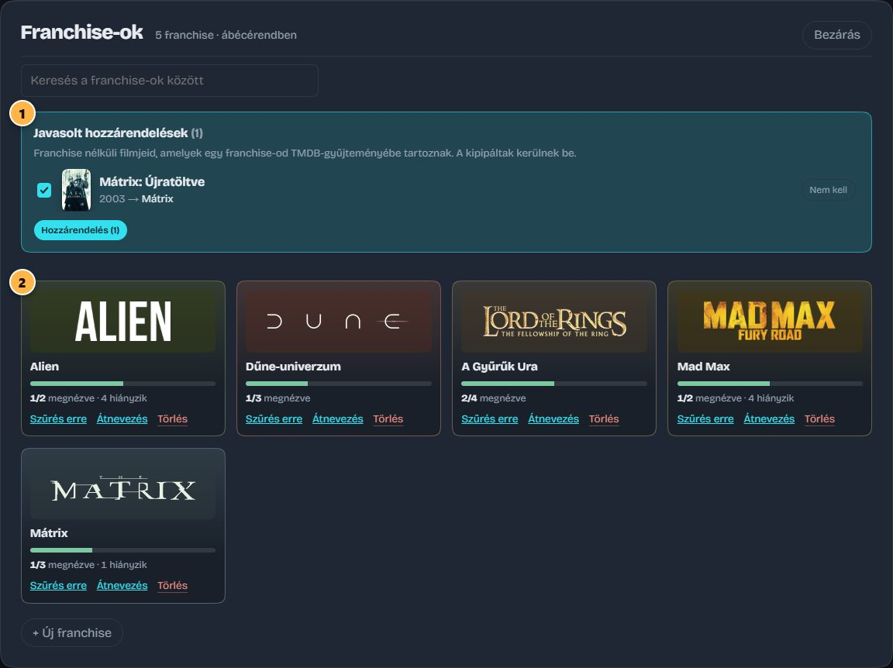

**Franchise-ok áttekintése** (⋮ menü → **Franchise-ok**, telefonon is): az összes franchise-od egy
ablakban, **ábécérendben** (a névelő – „A”, „Az”, „The” – nem számít: „A majmok bolygója” az M-nél
van).

① **Javasolt hozzárendelések** – fölül (ha van mit javasolni): a franchise nélküli filmjeid, amelyek
egy franchise-od TMDB-gyűjteményébe tartoznak, mellettük, hová kerülnének („2003 → Mátrix”). Alapból
mind ki van pipálva; amelyik nem kell, abból vedd ki a pipát, aztán **Hozzárendelés (N)**. Ha egy
javaslatot soha többé nem akarsz látni, a sor végén **Nem kell**. Ha nincs javaslat, ez a rész nem
látszik. A meglévő franchise-jelölésekhez nem nyúl.

② Csempénként:
- a franchise **logója** (ha nincs, a neve) – a csempe halványan felveszi a franchise legjobb
  címének borítószínét –, alatta a név és egy mérő: a listádon lévő címeiből mennyit láttál már
  (zöld; a még hiányzó részek nem számítanak bele);
- a számok: „1/2 megnézve · 4 hiányzik” – az első két szám a mérőé (megnézve / a listádon), a
  hiányzókat a TMDB-gyűjteményekből számolja (első megnyitáskor pár másodperc, amíg betöltődnek,
  addig „…”); gyűjtemény nélkül „nincs TMDB-gyűjtemény”, üres franchise-nál „Még nincs címe”;
- **a csempére kattintva** a franchise gyűjtemény-ablaka nyílik (lásd lent) – bezárva visszakerülsz a
  Franchise-ok ablakba;
- **Szűrés erre** – bezárja az ablakot, és a listán ennek a franchise-nak **minden** címe látszik (a
  többi szűrő elenged, a megnézettek is);
- **Átnevezés** (helyben; Enter: mentés, Esc: mégse) és **Törlés** (megerősítéssel – a címek a listán
  maradnak, csak a franchise-jelölésük kerül le).

Felül **kereső** (ékezet nélkül is talál), alul **„+ Új franchise”**: a név megadása után rögtön a
gyűjtemény-ablaka nyílik, ahol hozzárendelhetsz egy TMDB-gyűjteményt, és felveheted a részeit.

**Franchise beállítása egy címnél:** az adatlapon a Franchise mezőben, vagy a listasorban a
franchise lenyílóban. Lehetőségek:
- a meglévő franchise-aid;
- **„+ Új franchise…”** – helyben beírod a nevet (Enter: hozzáadás, Esc: mégse);
- **„✎ „Név” átnevezése…”** – helyben, a régi névvel kitöltve (Enter: mentés);
- **„× „Név” törlése…”** – megerősítés után minden címről lekerül.

**Franchise-szűrő logókkal:** a logót az app magától megkeresi a franchise első filmjéhez (a sötét
logókat fehérre színezi, hogy látszódjanak) – egy új franchise-nál rögtön, amint bekerül az első
címe (pár másodperc, újratöltés nélkül). Ha a TMDB-n nincs a filmhez logó, a név látszik, és az app
egy hét múlva újra próbálkozik.

**Franchise-ra szűrve minden látszik, sorban:** a típus „Filmek és sorozatok” lesz, az Állapot
„Mind” (a megnézettek is ott vannak, így látod az egészet), a rendezés pedig a franchise nézési
sorrendje, ha van ilyen (lásd lent), különben **Legrégebbi megjelenés**. Ha a franchise-szűrőt
megszünteted, az előző állapotszűrőd jön vissza (ha közben kézzel nem választottál másikat).

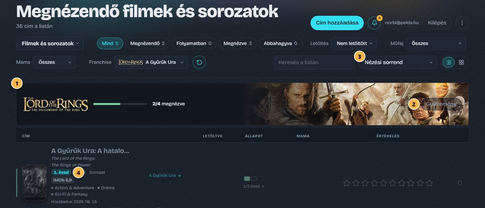

**Gyűjtemény sáv:** ① franchise-ra szűrve a lista fölött egy sáv jelenik meg: logó, mérő (a listádon
lévő címekből a megnézettek aránya, zölden) és „x/y megnézve · m hiányzik” (y a listádon lévők
száma, mint a mérőben; a „hiányzik” csak akkor, ha van még felvehető rész), a jobb
oldalán pedig a franchise legjobb értékelésű címének jelenetképe (ha annak nincs, a gyűjteményé).
③ Ha a franchise-nak van saját nézési sorrendje, a rendezés magától **Nézési sorrend** lesz, ④ a
sorozatok pedig évadonként külön sorban jönnek („2. évad”) – lásd lent.

② A **Gyűjtemény** gomb ablakot nyit, két füllel. Az ablak fejlécében is a sáv jelenetképe látszik.
Kikattintásra bezárul – akkor is, ha épp a TMDB-gyűjtemény keresője van nyitva; ha a Franchise-ok
ablakból nyitottad, kikattintva mindkét ablak bezárul.

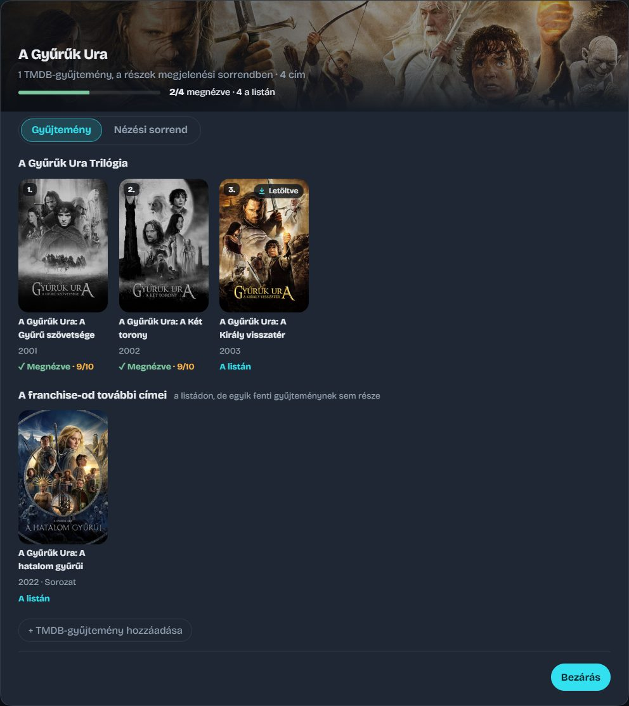

**Gyűjtemény fül:**
- szakaszonként a franchise filmjeinek **minden TMDB-gyűjteménye**, a részek megjelenési
  sorrendben, sorszámmal; a megnézettek szürkék a saját értékeléssel, a listán lévők „A listán”, a
  **hiányzók szaggatott kerettel, „+ Hozzáadás”** gombbal (a franchise-t is megkapják) – vagy
  egyszerre mind: **„A hiányzó N felvétele”**;
- **„A franchise-od további címei”**: ami egyik gyűjteményben sincs (pl. sorozatok);
- **„+ TMDB-gyűjtemény hozzáadása”**: ha az app magától nem találta meg, kézzel is hozzárendelhetsz
  egyet (keress rá – magyarul gyakran nincs találat, angolul igen, pl. „Star Wars”) →
  **Hozzárendelés**; a kézzel hozzárendelt szakasznál **Eltávolítás**.

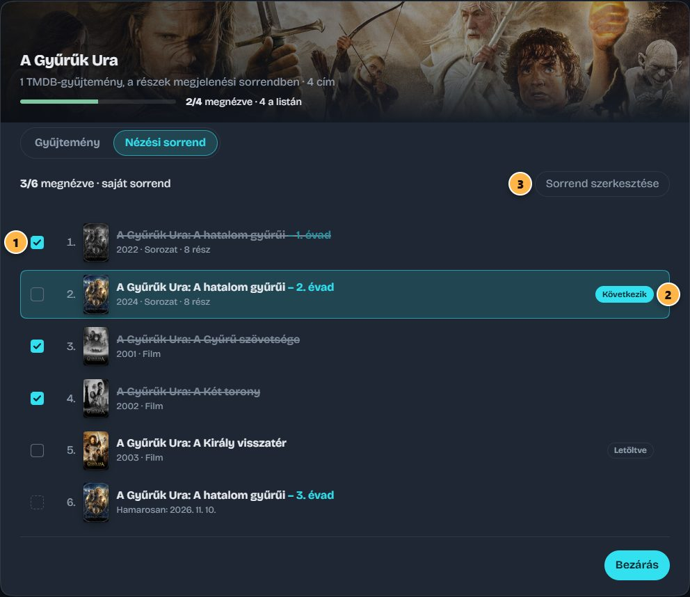

**Nézési sorrend fül** – ha nem a megjelenés sorrendjében akarod nézni (szia, Marvel!): a franchise
**listádon lévő** filmjei és a sorozatok **évadjai külön tételként** (pl. „A hatalom gyűrűi – 2.
évad”), számozott listában – így két évad közé egy film is beilleszthető. A TMDB-gyűjtemény hiányzó
részei itt nem szerepelnek.
- Amíg nem állítasz be saját sorrendet, **megjelenés szerint** áll; fent „x/y megnézve · megjelenés
  szerint” (vagy „saját sorrend”).
- ① **Kipipálás:** a tétel előtti jelölőnégyzettel a filmet vagy az évadot megnézettre állítod
  (ugyanaz, mintha a listán vagy az adatlapon tennéd). A megnézett tétel **kihúzva, halványan a
  helyén marad**, ② az első még meg nem nézett pedig kiemelve: **Következik** – így mindig tudod, mi
  jön. A pipát újra kattintva visszaveheted. Évadnál – mint a listán – az előtte lévő, még üres
  évadok is megnézettek lesznek („1. évad is megnézve.” → **Visszavonás**). Ha a cím ettől megnézett
  lett, és még nincs értékelése, a tétel alatt rögtön megkérdezi: **„Hogy tetszett?”** (vagy
  **Később**).
- A **bejelentett**, még meg nem jelent évad nem pipálható; az **abbahagyott** sorozat meg nem nézett
  évadjai „Abbahagyva” jelöléssel a helyükön maradnak, a „Következik” átugorja őket.
- ③ **Sorrend szerkesztése:** a tételek a bal szélükön lévő fogantyúval **húzhatók** (egérrel vagy
  ujjal), vagy a **↑ / ↓** gombokkal léptethetők. **Kész** – mentés; **Mégse** (vagy Esc) – elveti;
  **Megjelenés szerint** + **Kész** – a saját sorrend törlődik, újra megjelenés szerint áll.
  Szerkesztés közben az ablak kikattintásra nem zárul be, nehogy elvesszen a munkád.
- **Új cím vagy évad** (pl. új évad érkezik, vagy egy filmet a franchise-hoz rendelsz) a sorrend
  **végére** kerül – onnan szerkesztéssel áthelyezheted. Ha egy címet másik franchise-ba teszel,
  kikerül a régi sorrendből.

**Nézési sorrend a listán:** ha a franchise-nak van saját sorrendje, a franchise kiválasztásakor a
**Rendezés** magától **Nézési sorrend** lesz (más rendezés is választható; másik franchise-nál vagy
franchise nélkül az előző rendezés jön vissza, és ez a lehetőség nem is látszik). Ilyenkor a lista a
sorrend tételeit mutatja: a **sorozat évadonként külön sorban / kártyán**, „2. évad” jelöléssel,
akár több helyen is. Az állapot- és a letöltés-szűrő tételenként számít – a **Megnézendő** szűrővel
pontosan a még meg nem nézett filmek és évadok látszanak, sorrendben. Kész a nézési terved!

## 10. Mama-jelölések

Ha Mamának is gyűjtöd a jó filmeket, itt tarthatod számon, mi érdekli, és mit kapott már meg. A
legjobb az egészben: **Mama maga jelöli meg**, mi érdekli – a saját fiókjával, a saját oldalán (lásd
lent).

**A te oldaladon:**
- **Érdekli** / **Megkapta** – borostyánszínnel; **Nem érdekli** – tompa szürkével (ezt általában
  Mama jelöli). Az adatlapon gombként (újra kattintva törlődik), a listasorban lenyílóval.
- **A kártyán** csak az „Érdekli” látszik: borostyánszínű **„M”** a borító jobb felső sarkában (a
  többit a szűrő mutatja).
- **Mama-szűrő** (Összes / Érdekli / Nem érdekli / Megkapta) – akkor jelenik meg, ha van legalább egy
  jelölés. Így pillanatok alatt összeszeded, mit vigyél neki legközelebb.
- Ha Mama valamire azt mondja, hogy „Érdekel”, **a harang szól**: „Mamát érdekli” (lásd
  [11.](#11-értesítések)).

**Mama oldala – „Norbi filmjei”:**

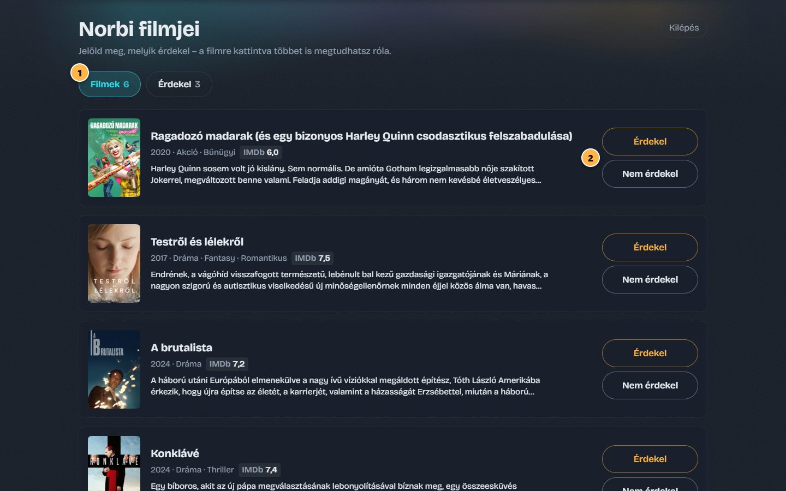

Mama a saját e-mail-címével és jelszavával lép be ugyanitt, és nem a te listádat látja, hanem egy
nagy betűs, egyszerű oldalt: **Norbi filmjei**. Rendezés, kereső, menü, harang nincs – csak a filmek
és két gomb:
- ① **Szűrő:** **Filmek** (alapból – amikről még nem döntött) és **Érdekel** (amiket bejelölt),
  mindkettő mellett a darabszám.
- A **Filmek** között a te **megnézendő, franchise nélküli, már megjelent filmjeid** vannak (a
  letöltöttek is), amelyeket még nem jelölt meg – a legutóbb hozzáadottak elöl, 24-esével („További
  filmek”). Sorozatot, a saját értékelésedet és az állapotokat nem látja.
- ② **Érdekel** (borostyán; bejelölve „✓ Érdekel”, újra kattintva visszavonja) és **Nem érdekel** (a
  sor eltűnik, alul **Visszavonás**, ha mellényúlt). A most jelölt sor a szűrő váltásáig a helyén
  marad.
- A borítóra vagy a címre kattintva **adatlap** nyílik: jelenetkép, borító, év, műfajok, IMDb,
  **Előzetes megnézése**, leírás, **Hol nézhető?**, alul a két nagy gomb.
- Az „Érdekel” filmek addig maradnak nála, amíg te **Megkapta**-ra nem állítod őket.
- Ha nincs új film, ezt írja: „Most nincs új film, amiről kérdeznénk.”

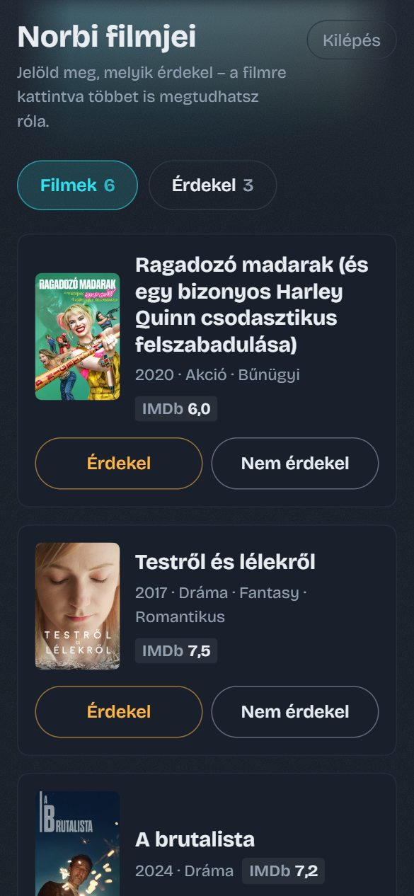

Telefonon a gombok a film alá kerülnek, az adatlap alulról csúszik fel (lehúzva bezárul). Mama
oldala net nélkül nem működik – ott nincs mentett lista.

## 11. Értesítések

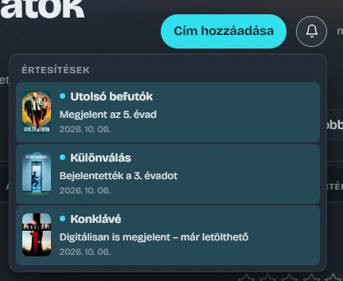

**Harang a fejlécben** – szól, ha valami történt a listádon. Az olvasatlan értesítések száma
borostyán jelvényben; ha nő a szám, a harang egyszer megrezzen. Kinyitva a legutóbbi 30, borítóval:
- „Bejelentették a 4. évadot – várható: <dátum>” (ha még nincs dátum, csak az első fele)
- „Megjelent az 5. évad”
- „Digitálisan is megjelent – már letölthető” (film)
- „Mamát érdekli” – Mama az oldalán „Érdekel”-t jelölt egy filmre (lásd [10.](#10-mama-jelölések))

Kinyitáskor mind olvasottá válik. Egy értesítésre kattintva a cím adatlapja nyílik. Kívülre
kattintva vagy Esc-re bezárul.

**Rendrakás a harangban:** ② a sor végén lévő **×** törli az értesítést (egérrel akkor látszik, ha a
sorra mutatsz; telefonon mindig), ① a fejlécben az **Összes törlése** pedig az összes látható
értesítést. Mindkettő után alul ott a **Visszavonás**, ha elkattintottad. A törölt értesítés nem jön
vissza – kivéve, ha Mama egy filmre újra „Érdekel”-t mond.

**Értesítősáv alul középen:** rövid üzenetek, pl. „Visszavonás” a törlés után, vagy a „Hogy
tetszett?”. 8 másodperc után eltűnik (a fogyó csík mutatja, mennyi ideje van még); ha rámutatsz,
megáll; a × gombbal azonnal bezárható.

## 12. IMDb

**IMDb-értékelés magától:** minden címnél „IMDb 8,0” jelvény; az app kéthetente frissíti. Rendezhetsz
is szerinte („Legjobb IMDb-értékelés”).

**⋮ menü → IMDb import** – ha az IMDb-n is vezetted a dolgaidat, nem kell újra begépelned.
(Asztalon és tableten; telefonon nincs, mert ott a CSV-fájlt nem lehet kényelmesen kiválasztani.)
Az IMDb két exportját fogadja, és magától rájön, melyiket adtad meg.

**A saját IMDb-csillagaid átvétele:**
1. Az IMDb-n a saját értékeléseid oldalán (*Your Ratings*) töltsd le az exportot (CSV-fájl).
2. Az appban: ⋮ → IMDb import → válaszd ki a fájlt.
3. Összefoglalót kapsz: hány értékelés van a fájlban, és ebből mi változik a listádon.
4. **Értékelések beírása.**

Szabályok: csak a listán már szereplő címek számítanak (IMDb-azonosító alapján), az IMDb-csillag
felülírja a sajátot, az állapot nem változik, új cím nem kerül fel.

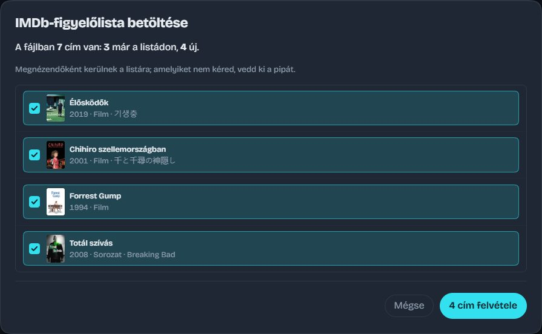

**Az IMDb-figyelőlistád (Watchlist) átvétele:**
1. Az IMDb-n a figyelőlistád oldalán töltsd le az exportot (CSV-fájl).
2. Az appban: ⋮ → IMDb import → válaszd ki a fájlt.
3. Az app megmutatja, hány cím van a fájlban, ebből mennyi van már a listádon, és mennyi az új; az
   újakat megkeresi a TMDB-n (címenként egy pillanat).
4. Az új címek listája borítóval, magyar címmel, évvel, típussal – alapból mind kipipálva; amelyik
   nem kell, abból vedd ki a pipát. Amit a TMDB-n nem talált, azt alul felsorolja.
5. **„N cím felvétele”** – Megnézendőként kerülnek a listádra.

Az epizódok, játékok, podcastok kimaradnak. Teljesen automatikus szinkron sajnos nincs (az IMDb-nek
nincs erre nyilvános felülete).

## 13. Statisztika

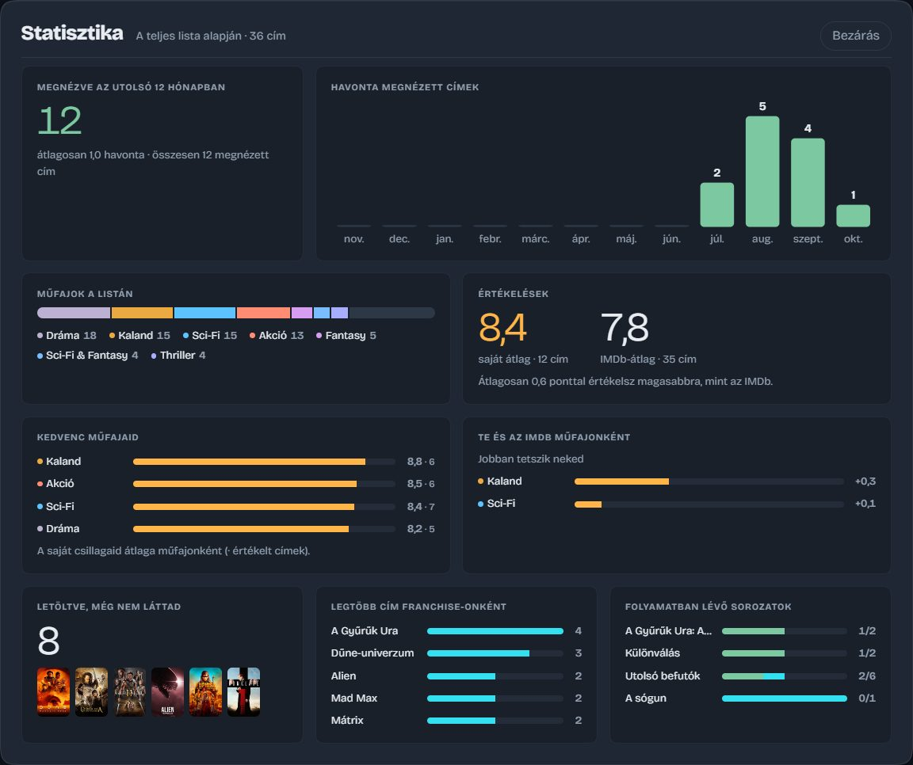

⋮ menü → **Statisztika** – kíváncsi vagy, mennyit néztél mostanában? A listádból számolt csempék:
- Megnézve az utolsó 12 hónapban
- Havonta megnézett címek (oszlopdiagram, a megnézés napja alapján – lásd [6.](#6-állapotok-letöltve-értékelések))
- Műfajok a listán (a műfajszínekkel)
- Értékelések (saját és IMDb-átlag – kiderül, szigorúbb vagy-e az IMDb-nél)
- **Kedvenc műfajaid** – a saját csillagaid átlaga műfajonként, a legjobb öt; a „8,8 · 6” azt jelenti:
  8,8-as átlag 6 értékelt címből
- **Te és az IMDb műfajonként** – hol értékelsz jobbra, mint az IMDb („Jobban tetszik neked”,
  borostyánnal), és hol vagy szigorúbb („Szigorúbb vagy”, szürkével), legfeljebb 3-3 műfaj, pl.
  „+0,3” vagy „−1,5”. Egy műfaj legalább 3 értékelt címtől számít – addig magyarázó szöveg áll a
  helyén
- Letöltve, még nem láttad
- Legtöbb cím franchise-onként
- Folyamatban lévő sorozatok (évadhaladás)

## 14. Mentések és adatbiztonság

A listádra többszörösen vigyázunk, nem kell izgulnod miatta.

**Automatikus heti mentés:** hétfőnként hajnalban mentés készül a listádról (címek, franchise-ok,
évadok, értesítések, nézési sorrendek, elrejtett ajánlások); a 8 hétnél régebbiek törlődnek. (A 2026.
10. 06. előtti mentések nézési sorrend nélkül állnak vissza.)

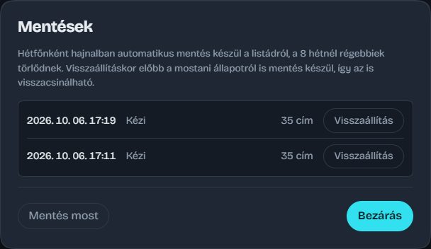

**⋮ menü → Mentések:**
- a mentések listája: dátum, fajta (*Heti* / *Kézi* / *Visszaállítás előtt* / *Feltöltött*), címek
  száma;
- **Mentés most** – azonnali mentés (pl. egy nagyobb átrendezés előtt, a biztonság kedvéért);
- **Visszaállítás** – megerősítés után a lista a mentés állapotára áll vissza. Előtte a mostani
  állapotról is mentés készül („Visszaállítás előtt”), így még a visszaállítás is visszacsinálható.

**Külső másolat:** hetente egy másolat a GitHubra is kerül (56 napig őrzi). Ha valaha az egész
adatbázis elveszne, ebből Claude vissza tudja tölteni a „Mentések” közé („Feltöltött”), és onnan a
szokásos módon visszaállítható.

**A gépeden tárolt lista:** hogy net nélkül is elinduljon (lásd [1.](#1-belépés-és-telepítés)), az
app a böngészőben megőrzi a legutóbb látott listádat. Ez csak egy másolat a gyors induláshoz – a
módosítások mindig az adatbázisba mennek. **Kilépéskor** a másolat törlődik, így egy közös gépen
sem marad ott a listád.

**Mentés letöltése** (⋮ menü, csak széles képernyőn): a teljes lista egyetlen CSV-fájlban, ami
Excelben dupla kattintással szépen megnyílik – típus, cím, év, állapot, letöltve, dátum,
értékelések, Mama, franchise, műfajok, évadok, hozzáadás dátuma, IMDb / TMDB azonosító.

## 15. Telefonon

  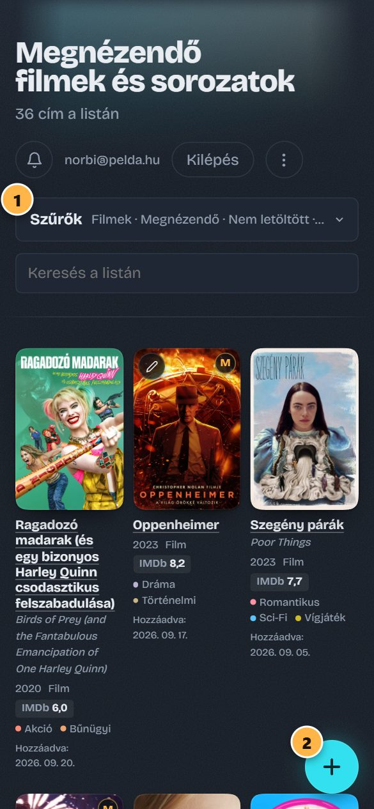
  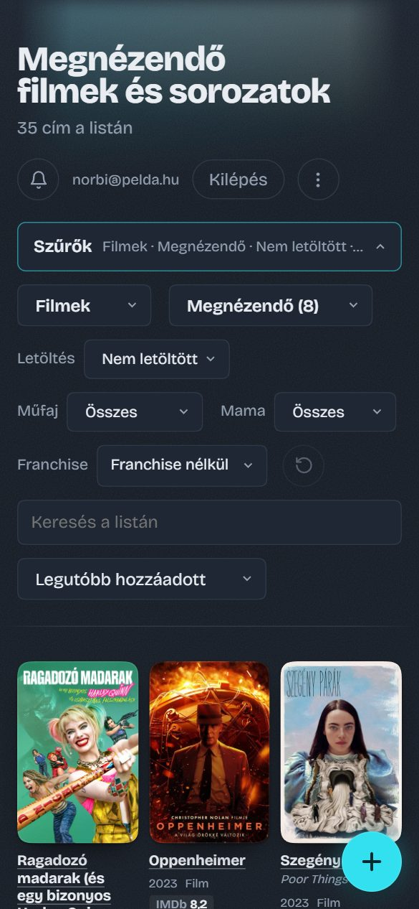
  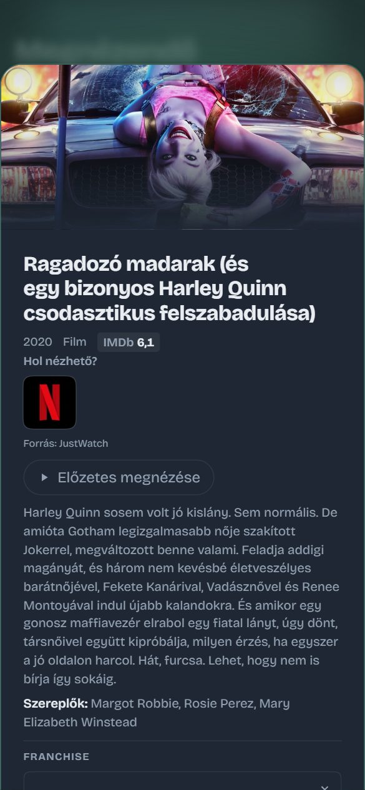

Zsebben is ugyanaz a lista, csak a képernyőhöz igazítva (640 px alatt):
- **3 kártya egy sorban**, kisebb betűkkel; a „Letöltve” jelvény csak ikon, mellette Mama „M”-je.
- ① **Szűrők összecsukva:** „Szűrők” gomb, mellette röviden, mi van beállítva (pl. „Filmek ·
  Megnézendő · Nem letöltött · Franchise nélkül”); kinyitva (középső kép) minden szűrő és a
  rendezés. A kereső mindig látszik.
- ② **Lebegő „+”** a jobb alsó sarokban (Cím hozzáadása); lefelé görgetéskor félrehúzódik, hogy ne
  takarjon.
- **Az adatlap alsó lap** (jobb oldali kép): alulról felcsúszik, lefelé húzva bezárul. A Hasonló
  címek csukva indul, a szereplők egy sorban, a leírás alatt látszanak.
- Az állapotszűrő itt lenyíló a gombsor helyett.
- A Felfedezés kiemelt sávjában ujjal húzva lapozhatsz; a kép fent, a szöveg alatta van.
- **Telefonon nincs:** lista nézet, Tömeges import, Mentés letöltése (ezek 1400 px-től érhetők el) és
  az IMDb import (tableten már megvan).

## 16. Billentyűzet, kényelmi apróságok

- **Esc** bezárja az adatlapot, a menüket és a felugró paneleket.
- **Kikattintás:** asztalon (és tableten) elég az ablak mellé, a sötét háttérre kattintani, és
  bezárul az adatlap, a Statisztika, a Franchise-ok, a gyűjtemény-ablak és a Mentések ablak. Nem
  zárul be, amíg valamit szerkesztesz vagy megerősítesz benne (pl. átnevezés, visszaállítás
  megerősítése, mentés folyamatban), az adatlap pedig mentetlen módosításnál szól. Telefonon a
  Bezárás / Esc / lehúzás zár. Az importablakok (Tömeges import, IMDb import) csak gombbal zárnak –
  nehogy egy félrekattintás elvigye a begépelt listádat.
- A **⋮ menüben** és a **franchise-szűrőben** nyilakkal, Home / End-del lehet lépkedni, Enter
  választ.
- A **csillagok** nyilakkal is állíthatók.
- A fejléc felugró listái (harang, ⋮) mindig a képernyőn belül nyílnak.
- **Kevesebb mozgás:** ha a Windowsban / telefonon be van kapcsolva az „animációk csökkentése”, az
  app minden animációt kikapcsol.
- Windows nagy kontrasztú módjában a rendszer saját vezérlői látszanak.

## 17. Honnan jönnek az adatok?

- **TMDB** (The Movie Database) – címek, magyar leírások, borítók, háttérképek, műfajok, évadok,
  megjelenési dátumok, előzetesek, szereplők, ajánlások, franchise-logók és -gyűjtemények. A lap
  alján ott a kötelező forrásmegjelölés.
- **OMDb** – az IMDb-értékelések (ha épp nem elérhető, az app értékelés nélkül is működik).
- **JustWatch** (a TMDB-n keresztül) – a „Hol nézhető?” szolgáltatói adatai.
- **A magyar szinkron** a TMDB-n nem szerepel, ezért a Felfedezés csak közelítés (lásd
  [4.](#4-címek-felvétele)).
- A listád a Supabase adatbázisban van, és csak a saját fiókoddal látható. Mama fiókja ebből csak
  annyit lát, amennyi az oldalához kell (a fent leírt filmek adatai, a te értékeléseid és állapotaid
  nélkül), és csak a Mama-jelölést tudja módosítani – mást nem.

---

## 18. Változásnapló

Minden frissítéskor ide kerülnek a közben elkészült változások (legújabb felül), és a fenti témák is
frissülnek.

| Dátum | Mi változott |
|---|---|
| 2026. 10. 08. | Net nélkül is elindul: az app azonnal a legutóbb látott listát mutatja, a frisset a háttérben tölti; internet nélkül csak nézelődni lehet, sáv jelzi ([1.](#1-belépés-és-telepítés), [14.](#14-mentések-és-adatbiztonság)). |
| 2026. 10. 08. | Adatlap: a Letöltve gombként működik, mint az Állapot és a Mama; asztalon szélesebb az ablak, és az Állapot, a Letöltés és a Mama egy sorban, középre zárva áll ([5.](#5-egy-cím-adatlapja-és-szerkesztése)). A kártyán a „Mama: …” felirat helyett borostyán „M” jel ([2.](#2-a-lista-nézetek-és-lapozás)). Javítás: a Javasolt hozzárendelések jelölőnégyzete látszik. |
| 2026. 10. 07. | Franchise-javaslat: felvételkor az app felajánlja a franchise-t, ha a film egy franchise-od gyűjteményébe tartozik; a Franchise-ok ablak tetején „Javasolt hozzárendelések” ([4.](#4-címek-felvétele), [9.](#9-franchise-ok-és-gyűjtemények)). „Neked ajánlott” sor a Felfedezésben a 8+ értékeléseid alapján ([4.](#4-címek-felvétele)). |
| 2026. 10. 07. | Értesítések törlése a harangból: × soronként, „Összes törlése”, visszavonható ([11.](#11-értesítések)). |
| 2026. 10. 07. | Mama saját oldala („Norbi filmjei”): Mama a saját fiókjával jelöli, mi érdekli (Filmek / Érdekel szűrő, adatlap); nálad „Nem érdekli” jelölés és „Mamát érdekli” értesítés ([10.](#10-mama-jelölések)). |
| 2026. 10. 07. | Ízlésprofil a Statisztikában: „Kedvenc műfajaid” és „Te és az IMDb műfajonként” ([13.](#13-statisztika)). |
| 2026. 10. 07. | Hasonló címek: csak 2000-es vagy újabb, a TMDB-n legalább 6,0-ra értékelt címek ([5.](#5-egy-cím-adatlapja-és-szerkesztése)). A gyűjtemény-ablak nyitott TMDB-keresővel is bezárul kikattintásra ([9.](#9-franchise-ok-és-gyűjtemények)). |
| 2026. 10. 07. | Gyorsindítók a telepített app ikonján: Cím hozzáadása, Franchise-ok, Statisztika ([1.](#1-belépés-és-telepítés)). |
| 2026. 10. 07. | „Kiemelt a mozikban” sáv a Felfedezés tetején: hat mozis film nagy jelenetképpel, logóval, adatokkal ([4.](#4-címek-felvétele)). Javítás: franchise-ra szűrve a lista tényleg a legrégebbi megjelenés szerint áll. |
| 2026. 10. 06. | Franchise-ra szűrve az Állapot magától „Mind”, a rendezés nézési sorrend nélkül „Legrégebbi megjelenés”; a franchise-ok számlálója a mérőhöz igazodik („x/y megnézve · m hiányzik”) ([3.](#3-szűrés-keresés-rendezés), [9.](#9-franchise-ok-és-gyűjtemények)). |
| 2026. 10. 06. | Képes lett ez a leírás: a témáknál képernyőképek a felületről (asztalon és telefonon), a zsúfoltabb képeken számozott jelölőkkel, és barátságosabb hangvétel. |
| 2026. 10. 06. | A Franchise-ok ablak csempéi saját színt kapnak (a franchise legjobb értékelésű címének borítójából): halványan színezett keret és logóháttér ([9.](#9-franchise-ok-és-gyűjtemények)). |
| 2026. 10. 06. | Szereplők az adatlapon: az első három szereplő fotóval és szereppel (asztalon a bal oszlopban, telefonon egy sorban a leírás alatt); a névre kattintva a színész TMDB-oldala ([5.](#5-egy-cím-adatlapja-és-szerkesztése)). |
| 2026. 10. 06. | Franchise-ra szűrve a lista fölötti sáv a franchise legjobb értékelésű címének jelenetképét kapja (a sáv jobb oldalán, balra a sötétbe olvadva), nagyobb logóval; a gyűjtemény-ablak fejléce is ezt a képet mutatja ([9.](#9-franchise-ok-és-gyűjtemények)). |
| 2026. 10. 06. | A franchise-ok mérője (a Franchise-ok ablak csempéin, a lista fölötti sávban és a gyűjtemény-ablakban): a listádon lévő címekből a megnézettek aránya, zölden – a még hiányzó részek nem számítanak bele, így ha mindet láttad, ami a listádon van, a sáv megtelik. (Eddig a jobb szélén mindig maradt egy keskeny szürkés rész.) |
| 2026. 10. 06. | Gyorsabb és takarékosabb működés: a háttérfrissítések (IMDb, háttérkép, évadok, megjelenési dátumok) csak akkor indulnak, ha van mit frissíteni; az adatlap gyorsabban nyílik (a bejelentkezés ellenőrzése helyben történik – emiatt egy másik eszközön kijelentkezve az ottani munkamenet legfeljebb egy óráig még működik). Javítás: 1000 cím fölött is a teljes lista betöltődik; rácsnézetben a nagyon hosszú, szóköz nélküli cím nem lóg rá a szomszéd kártyára. |
| 2026. 10. 06. | „Nem érdekel”: a Felfedezés és a Hasonló címek borítóin **×** – a cím többé nem ajánlott (visszavonható; a Felfedezés alján „Elrejtett ajánlások” → „Mégis érdekel”). Megnézettre állításkor egy zöld vonal fut végig a címen („kihúzás”) ([4.](#4-címek-felvétele), [6.](#6-állapotok-letöltve-értékelések)). |
| 2026. 10. 06. | Nézési sorrend a franchise-okban: a gyűjtemény-ablak új **Nézési sorrend** fülén a franchise filmjei és a sorozatok évadjai saját sorrendbe állíthatók (húzással vagy ↑ / ↓), kipipálhatók, a megnézett kihúzva a helyén marad, a következő kiemelve. Ha van saját sorrend, a listán a franchise kiválasztásakor a rendezés magától **Nézési sorrend** lesz, a sorozatok évadonként külön sorban ([9.](#9-franchise-ok-és-gyűjtemények)). |
| 2026. 10. 05. | A lábléc jobb alsó sarkában „sponsored by ADERTIS” felirat; az ADERTIS-ra kattintva a www.adertis.hu nyílik meg új lapon. |
| 2026. 10. 05. | Tömörebb adatlap: felül a Franchise és a Saját értékelés egymás mellett, alattuk egy keretes sávban az Állapot, a Letöltve és a Mama; a mezők címkéi kis nagybetűk – asztalon feleannyi helyet foglal ([5.](#5-egy-cím-adatlapja-és-szerkesztése)). |
| 2026. 10. 05. | Gyorsabb újranyitás: a TMDB-ről jövő adatokat (Hol nézhető?, előzetes, hasonló címek, gyűjtemény) a böngésző egy napig, a cím adatait és a Felfedezést egy óráig, a keresési találatokat 10 percig megjegyzi – ugyanaz az adatlap újranyitva azonnal kész. A saját listád adatai mindig frissek. Kevesebb háttérkérés betöltéskor. |
| 2026. 10. 05. | Simább adatlap-megnyitás: a háttérben érkező adatok (a borító színe, Hol nézhető?, előzetes, hasonló címek) megvárják, hogy a borító átsiklása véget érjen; nyitott ablaknál az aurora áll – terhelt gépen (pl. videó mellett) kevésbé szaggat. |
| 2026. 10. 05. | Javítás: a Felfedezés borítósorai nem tolják szélesebbre az oldalt – telefonon nem kicsinyedik az oldal, és a Felfedezésből nyitott adatlap is kifér; asztalon nincs felesleges vízszintes görgetősáv ([4.](#4-címek-felvétele)). |
| 2026. 10. 05. | Adatlap a listára vétel előtt: a Cím hozzáadása találatainak és a Felfedezés borítójára kattintva a cím adatlapja „Hozzáadás a listához” gombbal – felvétel után helyben a rendes adatlap; a Hasonló címek borítója ugyanabban az ablakban nyitja a hasonló címet, „Vissza” gombbal ([4.](#4-címek-felvétele), [5.](#5-egy-cím-adatlapja-és-szerkesztése)). |
| 2026. 10. 05. | Az új franchise logója rögtön megérkezik, amint az első címe bekerül – nem csak a következő betöltéskor ([9.](#9-franchise-ok-és-gyűjtemények)). |
| 2026. 10. 05. | Kikattintásra bezárul a Statisztika, a Franchise-ok, a gyűjtemény és a Mentések ablak is ([16.](#16-billentyűzet-kényelmi-apróságok)). |
| 2026. 10. 05. | „Franchise-ok” ablak a ⋮ menüben: ábécérend, logók, számok a hiányzókkal, gyűjtemény, szűrés, átnevezés, törlés, új franchise ([9.](#9-franchise-ok-és-gyűjtemények)). |
| 2026. 10. 04. | Nagyobb szolgáltatói logók; a ⋮ menüben a Statisztika az első; telefonon nincs IMDb import ([12.](#12-imdb), [15.](#15-telefonon)). |
| 2026. 10. 04. | „Hol nézhető?” az adatlapon: a magyar streamingszolgáltatók logója ([5.](#5-egy-cím-adatlapja-és-szerkesztése)); IMDb-figyelőlista importja – a menüpont neve „IMDb import” ([12.](#12-imdb)). |
| 2026. 10. 04. | Asztali rácsban a lapozó és alatta a lábléc az ablak alján áll – minden oldalon ugyanott, felesleges görgetősáv nélkül ([2.](#2-a-lista-nézetek-és-lapozás)). |
| 2026. 10. 04. | Asztali rácsban 22 cím egy oldalon (1440p-n 2 teli sor, tömörebb sorköz); nézetváltáskor a lap a látott címeknél marad ([2.](#2-a-lista-nézetek-és-lapozás)). |
| 2026. 10. 04. | Asztalon az adatlap kikattintásra bezárul; mentetlen módosításnál nyitva marad és figyelmeztet ([5.](#5-egy-cím-adatlapja-és-szerkesztése)). |
| 2026. 10. 04. | Az adatlapról lekerült a „Megnézve” dátummező; a megnézés napját az app a háttérben jegyzi meg ([6.](#6-állapotok-letöltve-értékelések)). |
| 2026. 10. 04. | A felhasználói leírás elkészült (a 2026. 10. 04-ig kész funkciókkal). |
| 2026. 10. 04. | Még meg nem jelent filmek: szaggatott keret, dátumos jelvény, harang a digitális megjelenésről ([8.](#8-még-meg-nem-jelent-filmek)). |
| 2026. 10. 04. | Franchise-gyűjtemény 2.: minden TMDB-gyűjtemény, a franchise további címei, kézi gyűjtemény ([9.](#9-franchise-ok-és-gyűjtemények)). |
| 2026. 10. 04. | Törlés visszavonása, „Hogy tetszett?”, barátságos üres oldalak, gyorsgombok a letapadt szűrősorban, előzetes, évadok idővonala, Felfedezés. |
| 2026. 10. 04. | Automatikus heti mentés, Mentések ablak, külső másolat ([14.](#14-mentések-és-adatbiztonság)). |
| 2026. 10. 04. | Listanézetben nagyobb borító és cím. |
